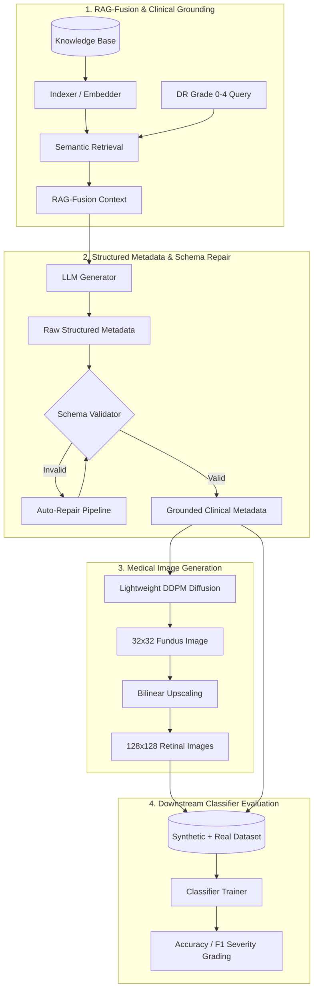

# SynthMed: Knowledge-Grounded Synthetic Medical Data Generation

SynthMed is a comprehensive framework designed for **Knowledge-Grounded Synthetic Medical Data Generation**, specifically tailored for Diabetic Retinopathy (DR) severity grading. It combines Retrieval-Augmented Generation (RAG), clinical metadata generation, automated schema validation and repair, and denoising diffusion image generation to construct high-fidelity, clinically sound synthetic medical datasets.

In low-data regimes, training robust deep learning models is challenging due to the scarcity of clinical data. **SynthMed** bridges this gap by augmenting limited real-world datasets with high-fidelity, schema-validated synthetic records and corresponding medical images.

---

## 🌟 Key Features

1. **RAG-Fusion Clinical Grounding**: Retrieves rich context from medical knowledge bases (PubMed abstracts, clinical guidelines) using a custom RAG-Fusion pipeline to ground synthetic records in real-world clinical science.
2. **Structured Metadata Generation & Schema Repair**: Automated LLM-based structured patient clinical metadata generation with built-in schema validation and automated repair algorithms to guarantee syntactical and logical clinical sanity.
3. **Lightweight DDPM Image Generation**: A custom, lightweight Denoising Diffusion Probabilistic Model (DDPM) designed for 32x32 retinal fundus image generation, scalable up to 128x128 via bilinear upscaling.
4. **Stratified Classifier Evaluation**: Downstream classification trainer designed to validate the clinical utility of the generated synthetic datasets across various low-data regimes.
5. **Robust Configurations**: Flexible, file-based experimental configs to easily reproduce baseline, ablation, and full pipeline runs.

---

## 📐 System Architecture

The following diagram illustrates the complete SynthMed generation and training pipeline:



---

## 📂 Project Structure

```
synthmed/
│
├── config/                  # Experiment YAML configuration files
│   ├── default.yaml         # Base setup configuration
│   └── schema/              # Metadata JSON schema rules
│       └── clinical_metadata.json
│
├── data/                    # Dataset directories (ignored by git, kept via .gitkeep)
│   ├── knowledge_base/      # PubMed abstracts and clinical guidelines
│   ├── raw/                 # Original real-world clinical records & fundus images
│   └── processed/           # Preprocessed dataset splits & .npy arrays
│
├── src/                     # Core python codebase
│   ├── classifier/          # Downstream neural network classifier modules
│   ├── data/                # Preprocessing, data augmentations, and dataset loaders
│   ├── evaluation/          # Evaluation metrics and report generators
│   ├── generation/          # DDPM Diffusion, metadata generator, & RAG grounding
│   ├── retrieval/           # RAG indexers, embedders, and fusion algorithms
│   ├── schema/              # Metadata validation and auto-repair pipelines
│   └── utils/               # Common helper utilities, logging, and seed initializers
│
├── tests/                   # Test suite for verifying core pipeline modules
│
├── README.md                # Project documentation
├── requirements.txt         # Python dependencies
├── setup.py                 # Setuptools installer
├── package.json             # Node dependencies (if applicable)
├── verify.py                # Dataset integrity verification script
└── run_final_experiment.py  # Script for executing CAISC experiments
```

---

## 🚀 Setup & Installation

### Prerequisites
* Python `3.9` or higher
* Node.js (if utilizing JS-based generation scripts)

### Installation Steps

1. **Clone the repository**:
   ```bash
   git clone https://github.com/14Aparajita/SynthMed.git
   cd SynthMed
   ```

2. **Set up a Virtual Environment**:
   ```bash
   python -m venv venv
   # On Windows:
   venv\Scripts\activate
   # On Unix/macOS:
   source venv/bin/activate
   ```

3. **Install Dependencies**:
   ```bash
   pip install -r requirements.txt
   pip install -e .
   ```

4. **Install Node dependencies** (if using the JS-based generation helpers):
   ```bash
   npm install
   ```

5. **Set up Environment Variables**:
   Copy `.env.example` to `.env` and fill in your API credentials (e.g. OpenAI/Anthropic/Kaggle keys if needed):
   ```bash
   cp .env.example .env
   ```

---

## 💻 Usage Guide

### 1. Data Integrity Verification
To verify that your raw datasets are correctly situated and formatted, run:
```bash
python verify.py
```

### 2. Running the Complete Experiment
To execute the CAISC experiment comparing classification accuracy across baseline and synthetic-augmented datasets, execute:
```bash
python run_final_experiment.py
```
This script runs a structured sweep across multiple real training sizes (`[100, 200, 500]`) and synthetic dataset sizes (`[0, 200, 500, 1000]`) and logs detailed outcomes.

### 3. Running Unit Tests
To verify individual modules (e.g., schema validation, retrieval indexing, or diffusion model sampling):
```bash
pytest tests/
```

---

## 📈 Key Findings & Observed Trends

Evaluation on Diabetic Retinopathy classification reveals:
1. **Low-Data Boost**: In highly restricted regimes (e.g., 100 real clinical samples), augmenting with SynthMed's grounded synthetic data provides the most significant classification accuracy improvements.
2. **Fidelity-Efficiency Tradeoff**: Validated and auto-repaired patient metadata coupled with grounded image upscaling produces robust feature representation without overfitting.
3. **Data Efficiency**: Models augmented with SynthMed achieve comparable performance to baseline models trained on significantly larger pools of real-world data.

---

## 📜 License
This project is licensed under the MIT License - see the LICENSE file for details.
